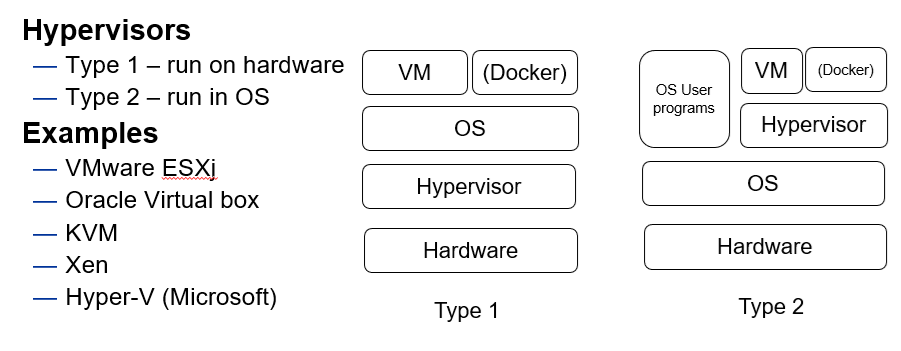

[Main Menu](../../../sessions/README.md)|[session1](../../session1/) | [Session 1 Notes](../docs/sessionNotes.md)

# Session 1 Notes and Exercises

## Git for Infrastructure as Code
Git is now widely used as the backbone `source of truth` for managing infrastructure as code.
In this class we will be using git extensively, so the first thing we need to consolidate is a basic understanding of how Git works

---
**Exercise 1.1**

Follow the notes in the usingGit folder the top of this repository in order to
* create and personalise your gitHub account
* create a personal fork of this repo
* begin writing notes and recording your own work in your own fork for later use in your report

---

## Operating Systems

Start by revising [Operating Systems Structure](./operating-systems-structure.md).

## Virtualisation

Virtualisation - type 1 / 2 hypervisor
VirtualBox
Vagrant

# Getting Started with Vagrant and Virtual Box
See [vagrant-examples](../session1/vagrant-examples)

## User Management
Post deploy script install what we need set up basic access
SSH based access for users - public private keys

