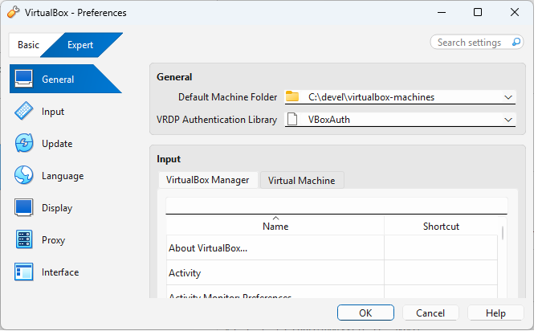

[Main Menu](../../../sessions/README.md)|[session1](../../session1/) | [Session 1 Notes](../docs/sessionNotes.md)

# Session 1 Notes and Exercises

## Git for Infrastructure as Code
Git is now widely used as the backbone `source of truth` for managing infrastructure as code.
In this class we will be using git extensively, so the first thing we need to consolidate is a basic understanding of how Git works

---
**Exercise 1.1**

Follow the notes in the usingGit folder the top of this repository in order to
* create and personalise your gitHub account
* create a personal fork of this repo
* begin writing notes and recording your own work in your own fork for later use in your report

---

## Operating Systems

Start by revising [Operating Systems Structure](./operating-systems-structure.md).

## Virtualisation

Virtualisation - type 1 / 2 hypervisor
VirtualBox
Vagrant

# Virtualisation Examples

## Installing VirtualBox
You can download VirtualBox from [VirtualBox Downloads](https://www.virtualbox.org/wiki/Downloads)

Other virtual box installers and iso files are here (i amusing version 7.2.4) https://download.virtualbox.org/virtualbox/https://download.virtualbox.org/virtualbox/7.2.4/

Wen you install VirtualBox, I recommend that you also need to set the preferences to place the virtual machines in a location which is not on a network drive.

# Building a VirtualBox machine from an .iso file

It is perfectly possible to build virtual box machines from a downloaded DVD `.iso` file using the VirtualBox gui.
You may already have done this. 
Lots of tutorials are available on line and the [VirtualBox documentation](https://www.virtualbox.org/wiki/Documentation) is quite useful

Here is a tutorial for installing Rocky Linux on VirtualBox manually from an iso
[Guide to Rocky on VirtualBox](https://docs.rockylinux.org/10/guides/virtualization/vbox-rocky/)
The basis steps will be the same for RHEL, Centos, Alma linux.

The isos for various releases are available on line and can be downloaded directly or faster by using `bittorrent` if it is not blocked on your network.

Alma Liux:

[https://almalinux.org/get-almalinux/](https://almalinux.org/get-almalinux/)

[https://repo.almalinux.org/almalinux/10/isos/x86_64/](https://repo.almalinux.org/almalinux/10/isos/x86_64/)

Rocky Linux:

[https://rockylinux.org/download](https://rockylinux.org/download)

[https://download.rockylinux.org/pub/rocky/10/isos/x86_64/](https://download.rockylinux.org/pub/rocky/10/isos/x86_64/)

# Getting Started with Vagrant and Virtual Box
See [vagrant-examples](../session1/vagrant-examples)

## User Management
Post deploy script install what we need set up basic access
SSH based access for users - public private keys

